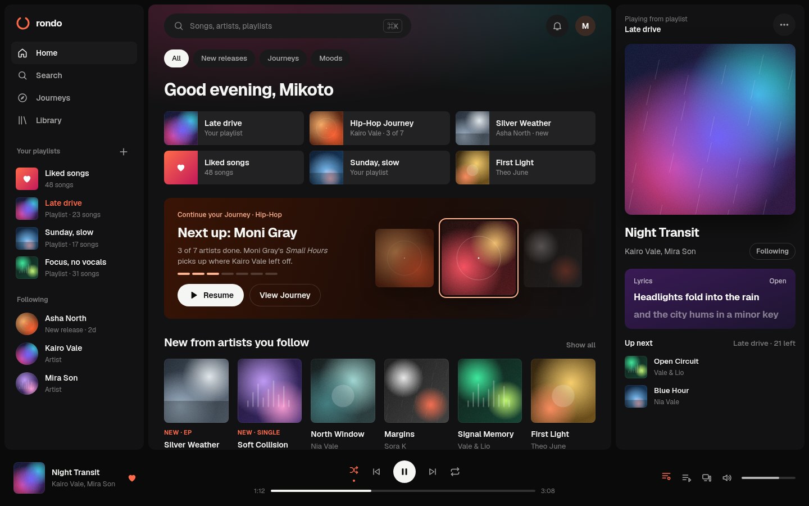
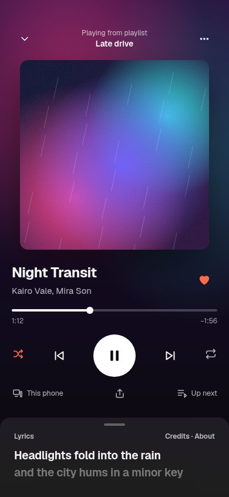
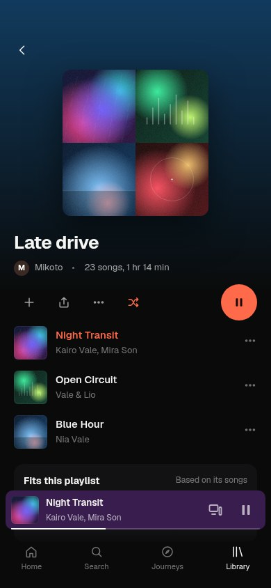

# Design study A — foundation (2026-10-04)

**Status:** proposal, awaiting owner verdict (D-049). Not app code. See [DESIGN_PROGRAM.md](../../../handoff/DESIGN_PROGRAM.md).

| Render | Surface |
| --- | --- |
|  | Home, desktop 1440×900: sidebar with playlists + followed artists, resume tiles, Journey progress card, new releases from followed artists, persistent Now Playing panel with "Playing from", lyrics card, Up next |
|  | Now Playing, mobile 390×844: art-driven ambience, source line, 5 transport controls, device/share/Up next, lyrics sheet peek (Lyrics · Credits · About) |
|  | User playlist, mobile 390×844: mosaic cover, owner/duration, add/share/shuffle/play, current song highlighted, "Fits this playlist" suggestions, mini player, tab bar |

Open the `.html` files directly in a browser to inspect (Geist loads from Google Fonts). Covers are code-drawn abstract placeholders (`covers.js`), intentionally text-free; they are not product assets.
