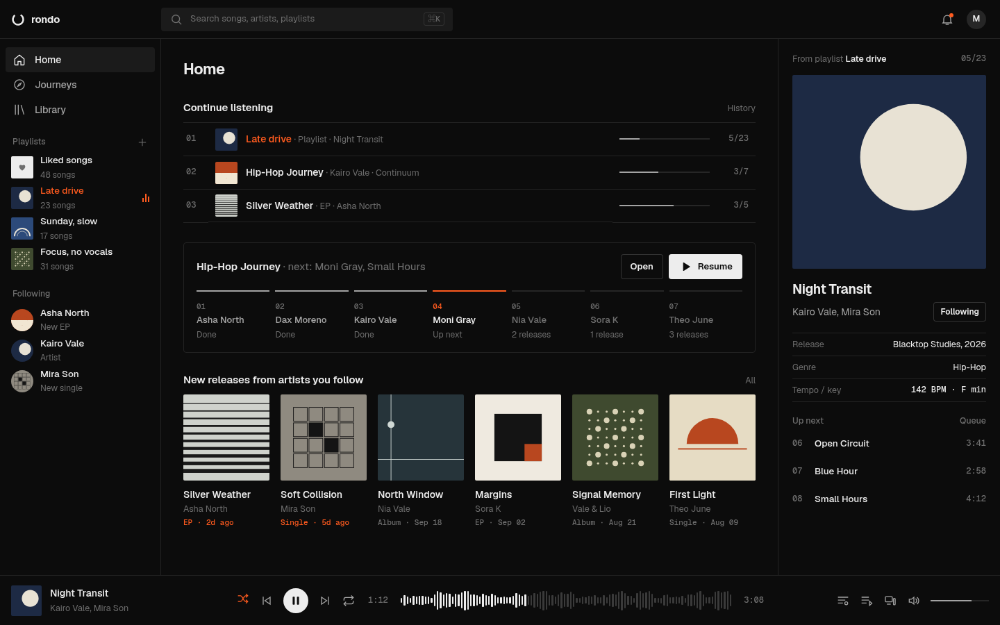
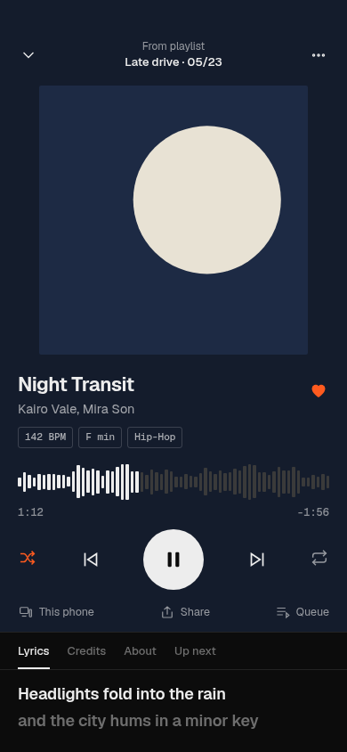
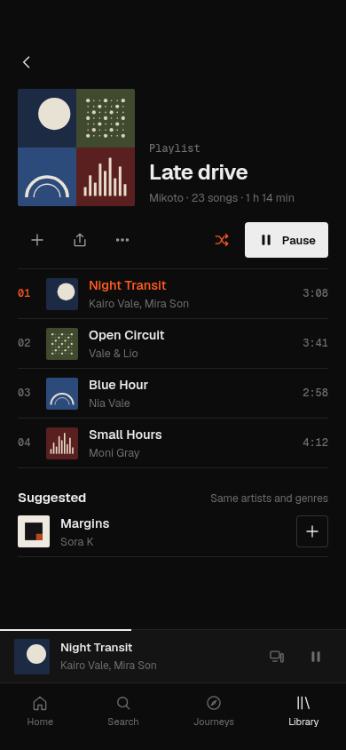

# Design study B — "instrument" foundation (2026-10-05)

**Status:** proposal, awaiting owner verdict (D-051). Replaces study A after the owner said A "feels overused and AI… not giving tech vibe".

| Render | Surface |
| --- | --- |
|  | Home 1440×900: top bar with ⌘K search, sidebar (playlists with counts, followed artists with release status), Continue listening as a numbered table with progress, Journey as a 7-step track, new releases with type/date, Now Playing panel with metadata table and numbered Up next, waveform scrubber |
|  | Now Playing 390×844: flat background tinted from the sleeve, mono BPM/key/genre tags, waveform scrubber, tabs Lyrics · Credits · About · Up next |
|  | Playlist 390×844: 2×2 mosaic, numbered tracklist with durations, Suggested (same artists and genres) |

What changed from A: no gradients/glows/blobs; flat Swiss-style sleeves; neutral #0c0c0c canvas with hairline structure; Geist + Geist Mono for numbers/metadata; 4px radius instead of pills; plain functional wording; accent orange only for "now playing" and live states. Sleeves are code-drawn placeholders, not product assets.
