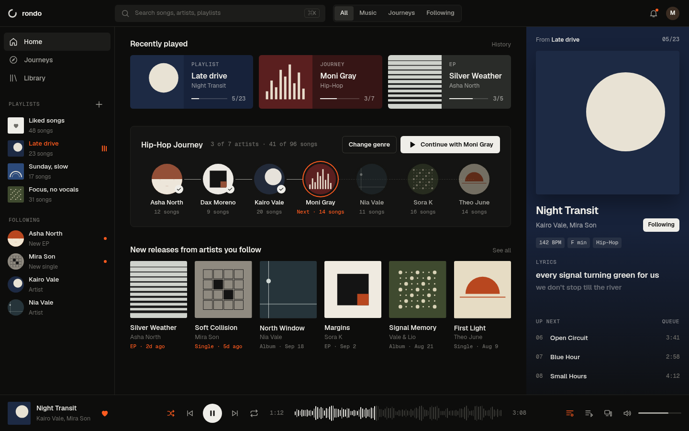
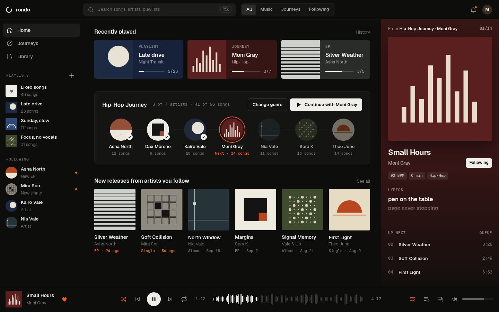
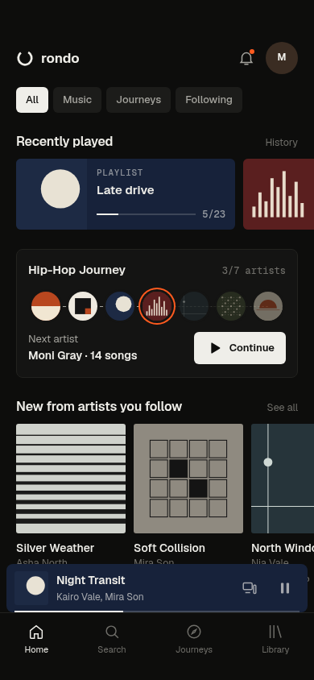

# Design study C — interactive foundation (2026-10-05)

**Status:** proposal, awaiting owner verdict (D-053). Follows owner feedback on B: "right direction… not very satisfied… make it more engaging, professional, smooth, advanced, creative and unique; no AI wording".

**Interactive:** open [home-desktop.html](https://htmlpreview.github.io/?https://github.com/MakeItRando/Rando/blob/main/design/studies/2026-10-05-foundation-c/home-desktop.html) — click any card, release, Journey button or Up next row; Space = play/pause; click waveform to seek; Next/Previous; like and follow toggles. Reduced Motion supported.

| Render | What it shows |
| --- | --- |
|  | Playing from playlist Late drive (navy panel from the sleeve) |
|  | After "Continue with Moni Gray": panel recolors to the sleeve, source switches to "Hip-Hop Journey · Moni Gray 01/14", sidebar stops marking Late drive |
|  | Mobile Home: Recently played carousel, compact Journey path, new releases, tinted mini player |

What's new vs B: colour from the sleeve as flat surfaces (Recently played cards, Now Playing panel, mini player) — engaging without gradients; Journey shown as a visual artist path (done ✓ / next ring / upcoming dimmed) — Rondo's signature; hover lift + play buttons, live lyrics line, animated playing indicator, waveform seek, 0.45s sleeve swap; segmented filter; truthful "From …" source on every play. Known study limitation: Up next list uses demo catalog songs, not the real per-source queue.
