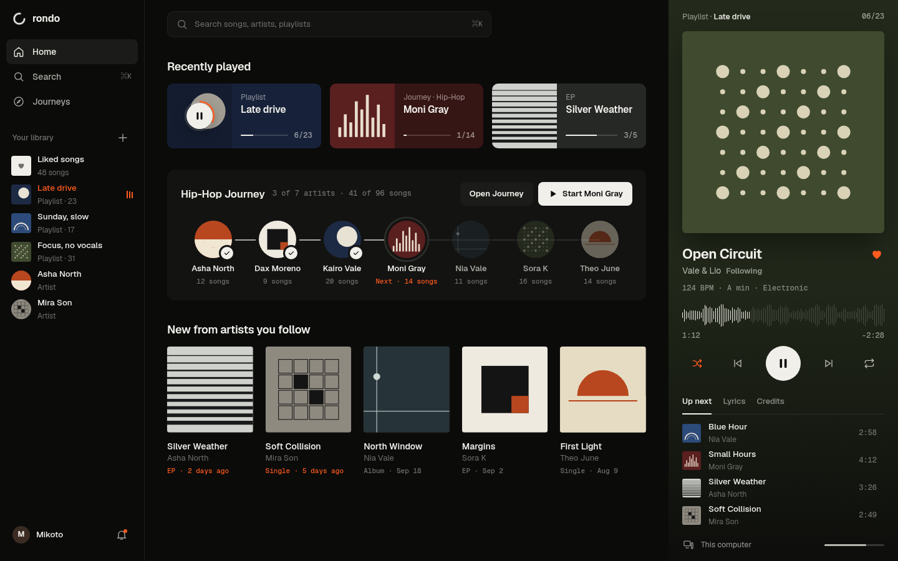
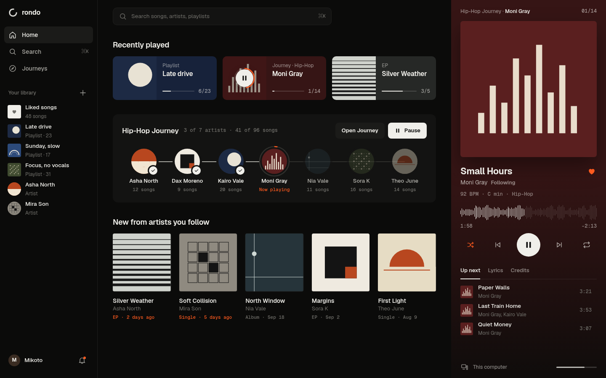

# Design study D — state-aware Home (2026-10-05)

**Status:** proposal, awaiting owner verdict (D-054). Owner on C: "way better", "way impressive", but the Journey action never changed ("always says continue even if it's playing"), some areas look old / not advanced, and some elements shouldn't be there.

**Interactive:** [open home-desktop.html](https://htmlpreview.github.io/?https://github.com/MakeItRando/Rando/blob/main/design/studies/2026-10-05-foundation-d/home-desktop.html)

| Render | State |
| --- | --- |
|  | Playlist Late drive playing: its card shows Pause with a live progress ring; Journey offers Open Journey + Start Moni Gray |
|  | Journey playing: Journey shows Open Journey + Pause, Moni Gray node says Now playing with a progress ring, player column shows Hip-Hop Journey · Moni Gray 01/14 and only Moni Gray's next songs |

## Changes vs C

- **Every play control is state-aware.** Cards, releases, Journey and sidebar know whether their source is playing: Play ↔ Pause, progress ring on the active one, Resume vs Start. Pressing the active source toggles it instead of restarting.
- **Journey actions:** "Open Journey" always available; primary is Start / Resume / Pause depending on state. "Change genre" removed from Home (it belongs on the Journey page).
- **Truthful queues per source.** Each source keeps its own position and Up next; a single or EP ends with "End of … Playback stops here." instead of borrowing unrelated songs (design answer to B-001/B-002).
- **Removed things that shouldn't be there:** duplicate bottom bar (the player column owns playback), All/Music/Journeys/Following filter, uppercase mono labels, BPM pills, separate Following sidebar section (artists live in Your library), History/See all clutter.
- **One player column:** source, art, title, artist + Follow, BPM/key/genre line, waveform seek, transport, tabs Up next · Lyrics (live line) · Credits, output device and volume. Colour follows the sleeve.
- Profile + notifications moved to the sidebar foot; search is a full-width ⌘K field.

Known limits: desktop only; collapsed-player and mobile versions follow once the desktop direction is approved. Sleeves are flat placeholders.
